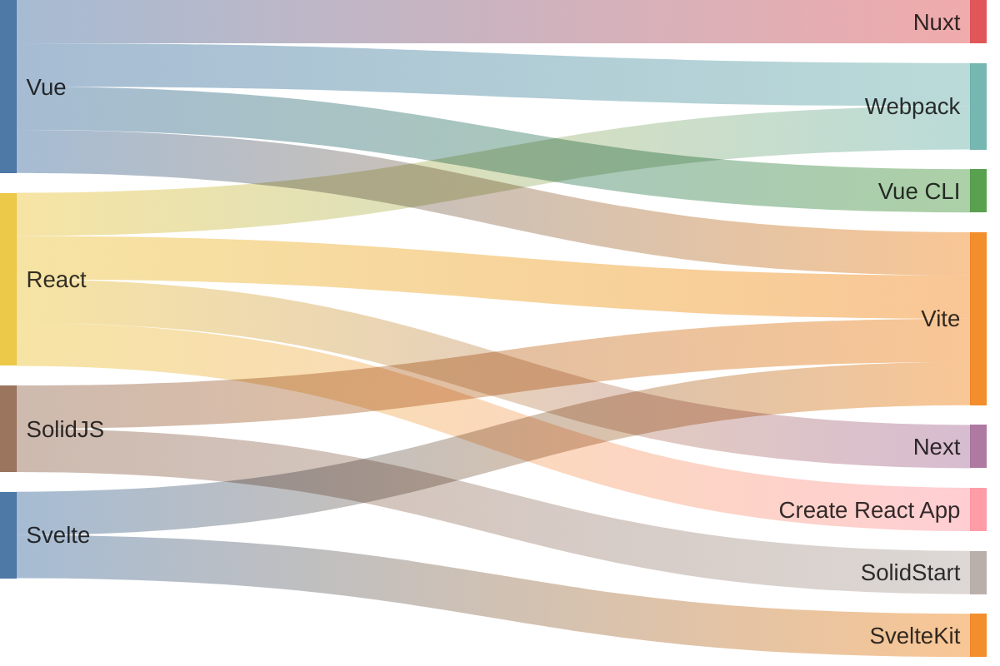

> 框架切换，捆绑器切换，自定义侧边栏和更好的用户体验。以及我如何在 Astro Starlight 上自定义文档。

[Gueleton]() 帮助开发者从现有页面自动生成占位骨架，这是我最近在做的一个项目。为了让它能够帮助到更多的开发者，我当然想让它能够运行在任何前端框架上。

因此，在 `server side` 我使用 `unplugin` 开发，在 `client side` 以 JS 代码为核心，再在上层开发各个前端框架的包装器。这在库开发中是常见做法，开发者总是希望自己的代码能够在通用性、易用性和可维护性上取得一个良好的平衡。

## 文档并不容易

得益于 `unplugin` 的支持，Gueleton 支持多种构建工具，如 `Vite`、`Nuxt`、`Webpack`。
并且在客户端，Gueleton 支持 `Vue`、`React`、`SolidJS`、`Svelte`。

在文档编写时，我碰到了一个问题。我需要一个支持渲染多框架组件的文档工具，以便我在文档中嵌入 Gueleton 在不同前端框架下的在线演示。

这让我非常希望找到一个支持多框架、多构建工具切换的文档。经过一番查找，最合适的是 Starlight：一个内容驱动的 Astro 文档框架，它快速方便，并内置搜索功能。

Starlight 基于 Astro，一个能够无缝运行各种 UI 组件的框架。我可以立即用它在一个页面上同时渲染 Vue 和 React 组件，这非常好。我不用再为每个框架创建不同的文档项目。

但这还不够，我还需要处理多种前端框架及其构建工具的排列组合。



在**极端**情况下，我们需要为每种组合编写单独的文档，这显然不是一个轻松的活。

一种理想的解决方案是 [Vercel 文档网站](https://vercel.com/docs/analytics/quickstart) 上的做法。如下所示，在切换侧边栏的框架选项时，文档细粒度的改变了内容。


这几乎就是我需要的文档，相信你也见过很多这样的文档结构，但是你有考虑过它如何实现吗？

基本上我们需要确定以下要求：

- **没有重复的内容**：所有内容都应该在一个地方进行维护。
- **按框架切换内容：文本、代码片段等**：自然的文档流，易于阅读。
- **没有冗余的侧边导航**：侧边栏不应该包含与当前框架无关的内容。

为了实现上述目标，我决定对 Starlight 进行一些自定义。

## 页面内容

目标是在一个页面上可以根据框架、语言提供不同的内容。用户可以通过页面交互选择自己想要的框架和语言。

虽然 Starlight 没有内置处理这种场景的功能，但好消息是 Astro 提供了足够的灵活性使得我们可以通过自定义来实现这些功能。


选择器是实现功能的关键组件，左边的选择器用于选择前端框架，右边的用于选择构建工具。

在内部，选择器将通过 MDX frontmatter 来了解要提供哪些框架：

```
---
title: 安装
description: 在不同的构建工具和框架中安装 Gueleton
frameworks:
- vue
- react
- angular
- vanilla
---
```

为了支持自定义 MDX frontmatter schema，只需要对 Starlight 文档集合模式进行一些补充：

```typescript
import { defineCollection, z } from 'astro:content';
import { docsLoader } from '@astrojs/starlight/loaders';
import { docsSchema } from '@astrojs/starlight/schema';

export const collections = {
  docs: defineCollection({ 
    loader: docsLoader(), 
    schema: docsSchema({
      extend: z.object({
        // 支持的框架列表
        frameworks: z.custom<FrameworkKey[]>().optional(),
      }),
    })
  }),
};
```

这将使我们能够在脚本中获取 frontmatter 定义的 `frameworks` 数据，并根据这些数据渲染框架选择器。

然后，还需要一个包装器，它将根据选择器当前的选项，渲染对应框架的内容。

```html
将 `unplugin-gueleton` 作为插件添加到你的构建工具配置中

<FrameworkSlots>
  <Code slot="nuxt" code={PluginSetupNuxt} lang="ts" title="nuxt.config.ts" />
  <Code slot="vite" code={PluginSetupVite} lang="ts" title="vite.config.ts" />
  <Code slot="webpack" code={PluginSetupWebpack} lang="js" title="webpack.config.js" />
  <Code slot="vue-cli" code={PluginSetupVueCli} lang="js" title="vue.config.js" />
</FrameworkSlots>

```

现在我们有了选择器的选项，还需要获取选择器当前所选的项。为了更好的用户体验，我会将选项保存在本地存储中，以便用户不会丢失首选项，同时还可以从 URL 查询参数中获取首选项。

## 共享状态

要让 `FrameworkSlots` 根据选择器的当前值变化，我们需要让它们能够访问同样的数据。

我使用 Astro 提供的 [Nano Stores](https://docs.astro.build/en/recipes/sharing-state/?ref=blog.arcjet.com) 创建状态管理。

```ts
// store.ts

import { atom } from 'nanostores';
import type { BoundlerKey, FrameworkKey } from '../content.config';
import type { Framework } from '../lib/frameworks';
import { frameworks, defaultFramework } from '../lib/frameworks';

// 当前显示的框架
export const displayedFramework = atom<FrameworkKey>(defaultFramework);

// URL 参数中的框架
export const queryParamFramework = atom<FrameworkKey | undefined>();

// 当前页面可用的框架列表
export const availableFrameworks = atom<Framework[]>(frameworks);
```

在组件中管理：

```vue
// FrameworkSwitcher.vue

<template>
...
</template>

<script setup lang="ts">
import { computed, onMounted, ref } from 'vue';
import { useStore } from '@nanostores/vue';
import { 
  displayedFramework, 
  availableFrameworks, 
  setDisplayedFramework,
  initializeFramework 
} from '../store/frameworks';
import type { FrameworkKey } from '../content.config';
import { getFramework } from '../lib/frameworks';
import type { StarlightRouteData } from "@astrojs/starlight/route-data";

interface Props {
  ...
  astroEntry: StarlightRouteData["entry"];
}

const props = withDefaults(defineProps<Props>(), {});

const $displayedFramework = useStore(displayedFramework);
const $availableFrameworks = computed(() => (props.astroEntry?.data?.frameworks || []).map((f) => getFramework(f)));

const handleChange = (event: Event) => {
  const target = event.target as HTMLSelectElement;
  const framework = target.value as FrameworkKey;
  setDisplayedFramework(framework);
};

onMounted(() => {
  initializeFramework();
});

</script>
```

```js
// FrameworkSlots.astro

<!-- 使用自定义元素 -->
<framework-slots>
  <div data-framework="vite" class="framework-slot" style="display: none;">
    <slot name="vite" />
  </div>
  ...
</framework-slots>

<script>
  import { displayedFramework } from "src/store/frameworks";

  class FrameworkSlots extends HTMLElement {
    connectedCallback() {
      ...
      this.updateDisplay();
    }

    updateDisplay() {
      const currentFramework = displayedFramework.get();
      const allSlots = this.querySelectorAll(".framework-slot");

      allSlots.forEach(slot => slot.style.display = 'none');
      
      const targetSlot = this.querySelector(`[data-framework="${currentFramework}"]`);
      if (targetSlot) {
        targetSlot.style.display = 'block';
      }
    }
  }

  customElements.define('framework-slots', FrameworkSlots);
</script>
```

## 如何组织文件

Starlight 已经提供了默认的文件结构，并且它还将根据文件结构生成侧边栏内容。

对于特定框架的代码片段等内容，我在 `src/` 下创建一个自定义的 `snippets/` 目录，所有特定于框架的代码片段都会被放置在这里。


每个代码示例都是一个实际存在的源文件，将通过 Vite 的 `?raw` 功能作为纯文本导入。

这样的好处是在编辑代码示例时，我们可以享受现代 IDE 提供的语法检查和智能提示，不至于回想起在**记事本**上写代码的痛苦体验。🐶

## 自定义 Astro Starlight 页面侧边栏

Astro Starlight 提供了重写和复用其默认UI组件的能力。

```ts
// overrides/PageSidebar.astro

---
import Default from '@astrojs/starlight/components/PageSidebar.astro';
import FrameworkSwitcher from '@components/FrameworkSwitcher.vue';

const props = Astro.locals.starlightRoute;
---

<>
  <!-- 框架选择器 -->
  <div class="framework-switcher-container p-4 border-b border-gray-200 dark:border-gray-700">
    <div class="w-min flex gap-2">
      <FrameworkSwitcher size="sm" client:load astroEntry={props.entry} />
      <BoundlerSwitcher size="sm" client:load />
    </div>
  </div>

  <!-- 默认侧边栏 -->
  <Default {...Astro.props}>
  </Default>
</>

```

然后，用 `overrides/PageSidebar.astro` 覆盖原始的 `PageSidebar.astro`。

```ts
// astro.config.mjs

import { defineConfig } from 'astro/config';
import starlight from '@astrojs/starlight';

// https://astro.build/config
export default defineConfig({
  ...
  integrations: [starlight({
    title: 'Gueleton',
    components: {
      ...
      PageSidebar: './src/components/overrides/PageSidebar.astro',
    },
  })],
});
```

## 全新的文档

在接下来的几周内，我将发布这个文档。用户将能在他们选择的框架中获得更好的体验。

MDX 的编写体验很不错，虽然相对于 Markdown 增加了一些复杂度，但同时为文档页面带来了更大的灵活性。与 Astro 结合后，我们可以在 MDX 中运行几乎任何框架开发的组件。

查看 [Gueleton 文档](https://gueleton.siaikin.me/zh-cn/guides/getting-started/installation/) 并检查其功能。

## 参考

本文基于 [Multi-framework docs with Astro Starlight](https://blog.arcjet.com/multi-framework-docs-with-astro-starlight) 的工作，将其部分功能使用 Vue 实现，对 React 熟悉的读者更推荐阅读原文。
