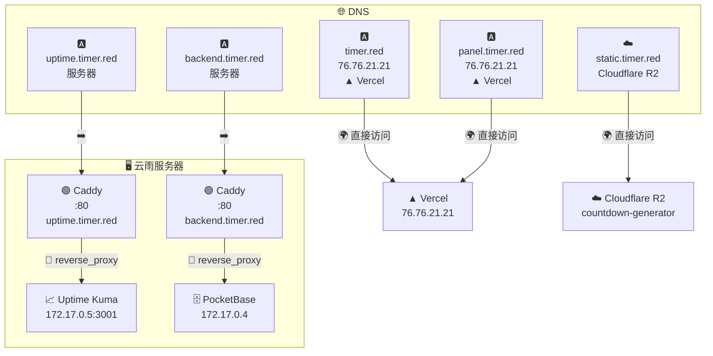

```mermaid
flowchart TD
    subgraph "🌐 DNS"
        D1["🅰️<br/>timer.red<br/>76.76.21.21<br/>▲ Vercel"]
        D2["🅰️<br/>uptime.timer.red<br/>服务器"]
        D3["🅰️<br/>backend.timer.red<br/>服务器"]
        D4["☁️<br/>static.timer.red<br/>Cloudflare R2"]
        D5["🅰️<br/>panel.timer.red<br/>76.76.21.21<br/>▲ Vercel"]
    end

    D1 -- "🌍 直接访问" --> Vercel["▲ Vercel<br/>76.76.21.21"]
    D4 -- "🌍 直接访问" --> R2["☁️ Cloudflare R2<br/>countdown-generator"]
    D5 -- "🌍 直接访问" --> Vercel["▲ Vercel<br/>76.76.21.21"]

    subgraph "🖥️ 云雨服务器"
        Caddy1["🟢 Caddy<br/>:80<br/>uptime.timer.red"]
        Caddy2["🟢 Caddy<br/>:80<br/>backend.timer.red"]
        Kuma["📈 Uptime Kuma<br/>172.17.0.5:3001"]
        PocketBase["🗄️ PocketBase<br/>172.17.0.4"]
    end

    D2 -- "➡️" --> Caddy1
    D3 -- "➡️" --> Caddy2
    Caddy1 -- "🔁 reverse_proxy" --> Kuma
    Caddy2 -- "🔁 reverse_proxy" --> PocketBase
```

`uptime.timer.red` 和 `backend.timer.red` 使用 CF 对实际 IP 🔐β MYxvLZrd4m/0zPAcFpARibLNMWoKpyIsXqckdagmDTP6GO8YX/jiiAY62vgEbxv4Ii8jIG3G3NX2392N 🔐 启用代理，然后通过 Caddy 根据域名反代到后面的具体服务上。
