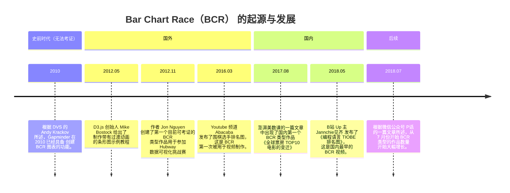

# TL;DR

# 什么是“动态排名条形图”？

![[Mar-16-2024 13-59-43.gif]]
> 图源[^5]

动态排名条形图 —— 就是类似上图这种根据一个时间序列变化条形图数据并带有过渡效果的动画。
这种条形图动画在国外被称为 “Bar Chart Race” 或 “Bar Rank” ，在国内他叫 “动态排名条形图”，“条形图竞赛”。

> [!info]
> 
下文中出现的 **“BCR”** 是 “Bar Chart Race，动态排名条形图” 的简写形式。

# “动态排名条形图”爆火的起点？
## 国外

根据互联网的公开资料，目前能够查到最早的 BCR 类型的视频作品是 Youtube 频道 Abacaba 在 2016年3月发布的《The history of the world's best Go players》[^3] 。
该视频使用 BCR 的形式展示了从 1974 到 2016 年世界最强围棋手排名变化。在该视频的评论区中大部分是围棋爱好者对其内容的讨论，然而有一小部分人对这种数据展现形式产生了兴趣。
![[截屏2024-03-16 14.45.03.png|300]]![[截屏2024-03-16 14.56.19.png|300]]![[截屏2024-03-16 14.56.26.png|300]]![[截屏2024-03-16 14.57.06.png|300]]![[截屏2024-03-16 14.57.49.png|300]]![[截屏2024-03-16 14.57.19.png|300]]![[截屏2024-03-16 14.57.34.png|300]]
这或许可以反映出在当时 BCR 类型的作品还并未大众所熟知。但在数据可视化领域中，早在 2012 年就已经出现 BCR 类型的作品[^2]了。

## 国内

一年后（2017年8月），在澎湃美数课的一篇文章 “《战狼2》跻身全球票房前百榜，而且99%靠的是本土票房[^4]” 中出现了**国内第一个 BCR 作品**《全球票房排行榜TOP10》。
![[Pasted image 20240316151451.png]]
在该文章的评论区中也有评论对其配图表达赞美，BCR 的魅力由此可见一斑。
![[截屏2024-03-16 15.22.05.png|300]]

又在一年后（2018年5月），B站 Up 主 Jannchie见齐 发布了《【数据可视化】【编程语言TIOBE排名】4分钟最流行的编程语言了解一下》[^5]，这是我能够查到的国内最早的 BCR 类型的视频作品。

**那么在国内 BCR 类型爆火的起点是在哪里呢？**

根据视频《谁是投稿数据可视化最多的up主？（4月-9月）》的内容，从 2018年7月中旬 开始，B站突然出现了大量数据可视化的投稿，并且投稿内容几乎都是 BCR 类型的视频。

而 Jannchie见齐 基于 D3.js 开发的动态可视化工具[^8] 在 2018/6/11 推送了第一个提交。

根据 stars 的历史数据，该项目在 2018/7/18 获得第一个 star 后快速上升，在 2018/9/7 获得了第一千个 star。

> 顺带一提 Jannchie见齐 在 2018/7/20 的视频《# 国际乒联女子乒乓单打积分排名》中才介绍了自己的动态可视化工具，所以实际上 star 的猛涨是从 2018/7/20 开始的。

![[截屏2024-03-16 16.23.59.png]]

从这些数据中可以看出，相当一部分 BCR 视频的热度是因为 Jannchie见齐 的开源项目带来的。

# “动态排名条形图”起源

根据《“网红柱状图”的前世今生》[^6] 内容所述，国内较早的一批 BCR 作品作者 澎湃美数课、B站 UP主 Jannchie见齐、狸子LePtC 是受到 **Abacaba 频道于 2016 年发布的围棋选手排名图**的启发。

但是根据我的调查，在目前的互联网上能够找到的最早的 BCR 作品是作者 Jon Nguyen 于 2012/11/3 创建的项目 [hubway-race](https://github.com/jon-n/hubway-race)。Jon Nguyen 为了更直观的看到自行车的行驶距离，无意间创建了第一个 BCR 作品。

> I can tell you that I didn't take inspiration from anywhere for the chart.  I was learning D3.js at the time, and I liked the idea of a bar chart that could scroll down because there weren't constraints on the size of the chart on the web, and because there were a lot of bikes in the data set.  At first I had the bars grow in place, but then I played around with the sorting idea because it was hard to compare bikes otherwise with the long scroll.

> 该项目被用于参加 “Hubway 数据可视化挑战赛”，令人遗憾的是在 2012 年的 Hubway 数据可视化挑战赛中，该作品并未获奖。毕竟获奖的参赛作品即使放到今天都是极为优秀的。有兴趣可以查看这个页面 [Hubway data visualization challenge winners](https://web.archive.org/web/20140811065342/https://visualoop.com/3293/hubway-data-visualization-challenge-winners) 列出的获奖作品，仅是通过截图都能感受到作品的优秀。
> 
> 顺带一提，hubway-race 的评分是 `1.875`，而总冠军是 [Ta Virot Chiraphadhanakul](https://tvirot.medium.com)，他的作品评分为 `2.84` （满分 5 分）。

虽然该项目创建于 11月3号 但是实现了 BCR 效果的代码于 2012/11/4 提交。因此，根据我能够找到的信息，BCR 作品最早出现在 2012/11/4 。

但时间线还可以继续前进。根据《“网红柱状图”的前世今生》所述，D3.js 作者 Mike Bostock 在 2012/5/16 发布了一个教程[^1]，该教程主要是说明 D3.js 中的过渡动画功能能够让图表具有 *对象恒常性（object constancy）* ，这能够给用户带来更好的体验。
![[Mar-17-2024 00-21-26.gif]]

在 Jon Nguyen 的参赛作品[^2] 和 Jannchie见齐 的开源项目[^8] 中都可以看到该教程中代码的影子，这三者具有相同的函数名和变量名，以及具有类似的代码逻辑。虽然 Mike Bostock 的教程中所展示的示例与现在的 BCR 作品还有差距，但可以确定的是，最初的 BCR 作品从中获得了灵感。

为什么会说是**很有可能**呢？因为还存在一个现在已无法考据的说法。

>另外，根据 DVS 的 Andy Krackov，Gapminder 2010 年左右已经具备该功能。当时只需要在 Google Sheets 中按模板填入数据，则可以通过 Gapminder 网站上生成该图。这个体验是不是和今天各种工具的 “一键成图” 非常像？
>
>You know, I remember using animated bar charts back in 2010 or so. This was through Google Sheets. From what I recall, they had bought the gapminder technology (Hans Rosling's innovations) and that included animated vertical bar charts. I used them to show the county-level change in teen birth rates and autism diagnoses.
>
Glad you found that. I was looking myself for the animated bar charts that I created. Couldn't find it. I think Google Sheets removed these options a few years back. But I want to say it became available around 2010. Maybe it was earlier, based on this article:
>https://venturebeat.com/2007/03/19/google-buys-gapminder-a-graphical-display-company/
>
>来源[^6]

如果上述说法无误，那么 BCR 最早便可以追溯到 2010 年甚至更早。

根据现在留存下来的 Gapminder 软件截图，Gapminder 的展现方式与 BCR 的区别仅在于他展示的是气泡图而不是条形图。称他们是异父异母的亲兄弟都不为过。
![[Mar-17-2024 03-32-35.gif]]
> Gapminder 软件截图

但 Gapminder 当时的离线安装包现在已经无法运行，而 Google Sheets 作为动态网页导致 Internet Archive 上都没有存档保留。这段历史或许只有 Google 当时的相关人员才能证明。

根据上述信息，Jon Nguyen 的 hubway-race 是最早的 BCR  作品，出现于 2012/11/4，虽然这个作品几乎无人问津，但他仍然是事实上的第一。直到四年后 Abacaba 发布了 《The history of the world's best Go players》BCR 才真正在出现在大众视野。
# 结语

第一次写考古文章，这才知道到信息的搜集整理需要付出多大的时间精力，难以想象 B站 上那些干货科普视频的工作量是何等恐怖。

# 感谢

特别感谢微信公众号“P话”的《“网红柱状图”的前世今生》，本文很多资料都是来源于这篇文章，甚至可以说是从开发人员的角度重新解读了这篇文章。
感谢 [Jon Nguyen](https://twitter.com/athst)的支持。

[^1]: Mike Bostock 的 D3 示例 https://bost.ocks.org/mike/constancy/
[^2]: Jon Nguyen： hubway-race https://jon-n.github.io/hubway-race/
[^3]: Abacaba：The history of the world's best Go players https://www.youtube.com/watch?v=oRvlyEpOQ-8
[^4]: 澎湃美数课：《战狼2》跻身全球票房前百榜，而且99%靠的是本土票房 https://www.thepaper.cn/newsDetail_forward_1766460
[^5]: Jannchie见齐：《【数据可视化】【编程语言TIOBE排名】4分钟最流行的编程语言了解一下》 https://www.bilibili.com/video/BV1GW41137xm
[^6]: P话：《“网红柱状图”的前世今生》 https://mp.weixin.qq.com/s?__biz=MzA3Nzk3MTcwNw==&mid=2649386954&idx=1&sn=d5185938b97967473828d96054856611&chksm=8757265eb020af4856af63c73ae217ec37df15b5d5d2e93fa8b1248107bf7a51103f35782e9b&scene=4#wechat_redirect
[^7]: 范范被坑：《谁是投稿数据可视化最多的up主？（4月-9月）》 https://www.bilibili.com/video/BV1Ps411F75G
[^8]:  Historical-ranking-data-visualization-based-on-d3.js https://github.com/Jannchie/Historical-ranking-data-visualization-based-on-d3.js
