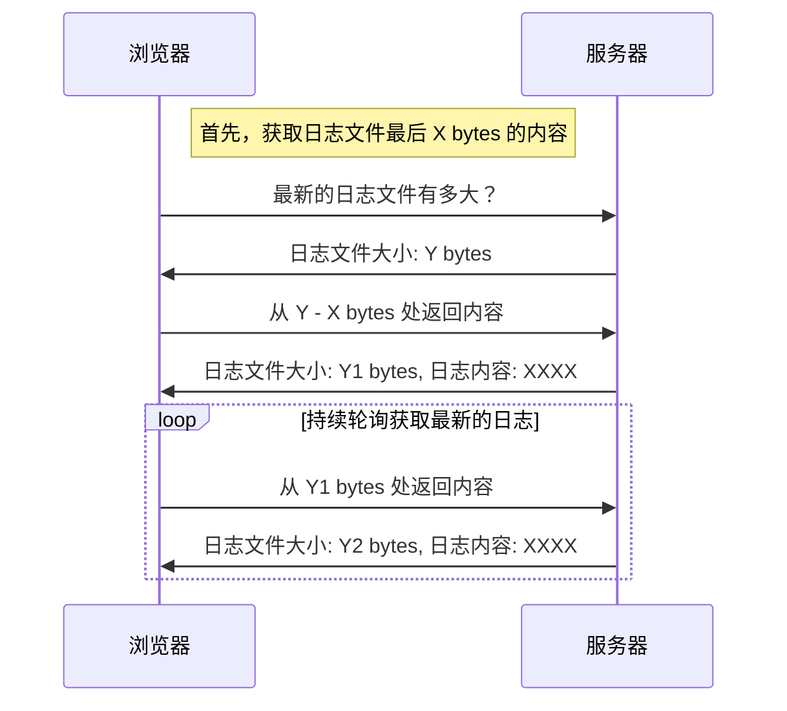

	![[Feb-20-2024 21-40-36.gif]]
## 背景

cron service 在执行定时任务时，需要能够**实时**查看该任务的执行日志以确保程序正确的工作。为了能够在尽可能短的时间内实现该功能，我们需要一个足够**简单**的方案。

## 方案如何选择？

我相信大多数开发者第一个想到的就是 WebSocket ，然后是 HTTP/SSE 。WebSocket 在很多情况下是实至名归的万金油选择。但这这里他太重了，对服务端和客户端具有侵入性需要花费额外的时间来集成到项目中。

那么 SSE 呢，为什么不是他？
虽然 SSE 即轻量又实时，但 SSE 无法设置请求头。这导致无法使用缓存和通过请求头设置的 Token。而且作为长链接他还一直占用并发额度。

- `WebSocket`：❌
	- 优势：
		- 实时性高
		- 不会占用 HTTP 并发额度
	- 劣势：
		- 复杂度较高，需要在客户端和服务器端都进行特殊的处理
		- 消耗更多的服务器资源。
- `SSE(Server-Sent Events)`：❌
	- 优势：
		- 基于HTTP协议，不需要在服务端和客户端做额外的处理
		- 实时性高
	- 劣势：
		- 无法设置请求头
		- 占用 HTTP 并发额度
- `HTTP`：✅
	- 优势：
		- 简单易用，不需要在服务端和客户端做额外的处理。
		- 支持的功能丰富，如缓存，压缩，认证等功能。
	- 劣势：
		- 实时性差，取决于轮询时间间隔。
		- 每次HTTP请求都需要建立新的连接（仅针对 HTTP/0.x 而言）并可能阻塞同源的其他请求而导致性能问题。[^1][^2]
			- HTTP/1.x 支持持久连接以避免每次请求都重新建立 TCP 连接，但数据通信是串行的。
			- HTTP/2.x 支持持久连接且支持并行的数据通信。

> 以上列出的优缺点是仅对于本文所讨论的场景（即**Web 端的实时日志**）而言，这三种数据交互技术在其他场景中的优缺点不在本文讨论范围内。

## 实现

HTTP 轮询已经是老熟人了，不再做介绍。本文的着重于实时日志的实现及优化。



上方是基本工作原理的流程图。
实现的关键点在于
- 前端如何知道日志文件当前的大小
- 服务端如何从指定位置获取日志文件内容

这两点都可以通过 HTTP Header 来解决。[Content-Range](https://developer.mozilla.org/en-US/docs/Web/HTTP/Headers/Content-Range) HTTP 响应头会包含完整文件的大小，而 [Range]() HTTP 请求头可以指示服务器返回指定位置的文件内容。

因此在服务端不需要额外的逻辑，仅通过 Web 端代码就可以实现实时日志功能。

#### 代码实现

> 篇幅限制，代码不会处理异常情况

首先，根据上述流程图。我们需要获取日志文件的大小。

```javascript
const res = await fetch(URL, {  
  method: "GET",  
  headers: {  Range: "bytes=0-0"  }
});

const contentRange = res.headers.get("Content-Range") || "";  
const match = /bytes (\d+)-(\d+)\/(\d+)/.exec(contentRange);  

// 日志文件大小
const total = Number.parseInt(match[3], 10);
```

> `Range: "bytes=0-0"` 指定仅获取第一个字节的内容，以免较大的日志文件导致响应时间过长。

我们发起了一个 GET 请求并将 `Range` 请求头设置为 `bytes=0-0` 如果服务器能够正确处理 Range 请求头，响应中将包含一个 `Content-Range` 列其中将包含日志文件的完整大小，可以通过正则解析拿到。

现在我们已经拿到了日志文件的大小并存储在名为 `total` 的变量中。然后根据 `total` 获取到最后 10 KB 的日志内容。

```javascript
const res = await fetch(url, {  
  method: "GET",  
  headers: {  
    Range: `bytes=${total - 1000 * 10}-`
  }
});

const contentRange = res.headers.get("Content-Range") || "";
const match = /bytes (\d+)-(\d+)\/(\d+)/.exec(contentRange);

// 下一次请求的起始位置
const start = Number.parseInt(match[2], 10) + 1;

// 日志内容
const content = await res.text();
```

现在我们发起了一个 GET 请求并将 `Range` 请求头设置为 `bytes=${total - 1000 * 10}-` 以获取最后 10 KB 的日志内容。并且通过正则解析拿到了下一次请求的起始位置。

现在我们已经拿到了日志文件的大小和最后 10 KB 的日志内容。接下来就是持续轮询去获取最新的日志。轮询代码区别仅在于将 `Range` 标头设置为 `bytes=${start}-` 以便获取最新的日志。

```javascript
const res = await fetch(url, {  
  method: "GET",  
  headers: {  
    Range: `bytes=${start}-`
  }
});

const contentRange = res.headers.get("Content-Range") || "";
const match = /bytes (\d+)-(\d+)\/(\d+)/.exec(contentRange);

// 下一次请求的起始位置
start = Number.parseInt(match[2], 10) + 1;

// 日志内容
const content = await res.text();
```

以上，基本的功能已经实现了。日志内容保存在名为 `content` 的变量中。

#### 优化

HTTP 轮询常因其高延迟为人诟病，我们可以通过指数退避的方式来尽可能的降低延时且不会显著的增加服务器负担。

指数退避是一种常见的网络重试策略，它会在每次重试时将等待时间乘以一个固定的倍数。这样做的好处是，当网络出现问题时，重试的时间间隔会逐渐增加，直到达到最大值。

一个简单的实现如下：
```typescript
/**
 * 使用指数退避策略获取日志.
 */
export class ExponentialBackoff {
  private readonly base: number;
  private readonly max: number;
  private readonly factor: number;
  private retries: number;

  /**
   * @param base 基础延迟时间 默认 1000ms (1秒)
   * @param max 最大延迟时间 默认 60000ms (1分钟)
   * @param factor 延迟时间增长因子 默认 2
   */
  constructor(base: number = 1000, max: number = 60000, factor: number = 2) {
    this.base = base;
    this.max = max;
    this.factor = factor;
    this.retries = 0;
  }

	/**
	 * 获取下一次重试的延迟时间.
	 */
	next() {
    const delay = Math.min(this.base * Math.pow(this.factor, this.retries), this.max);
    this.retries++;
    return delay;
  }

  /**
	 * 重置重试次数.
	 */
  reset() {
    this.retries = 0;
  }
}
```

值得一提的是带有 `Range` 标头的请求成功时会返回 `206 Partial Content` 状态码。而在请求的范围超出文件大小时会返回 `416 Range Not Satisfiable` 状态码。我们可以通过这两个状态码来判断请求是否成功。

成功时调用 `reset` 方法重置重试次数，失败时调用 `next` 方法获取下一次重试的延迟时间。

## 总结

即使再优秀的方案也不是银弹，真正合适的方案需要考虑的不仅仅是技术本身，还有业务场景，团队技术栈，团队技术水平等等。在选择技术方案时，我们需要权衡各种因素，而不是盲目的选择最流行的技术。

当我们责备现有的技术方案为何如此糟糕时，或许在那个时间点上，这个方案是最合适的。

![[Pasted image 20240220213326.png]]

感谢以下网友的帮助和建议：[齐洛格德](https://juejin.cn/user/2692085333374728)


[^1]:  [15 题：简单讲解一下 http2 的多路复用](https://github.com/Advanced-Frontend/Daily-Interview-Question/issues/14#top)
[^2]: [Connection](https://developer.mozilla.org/en-US/docs/Web/HTTP/Headers/Connection)